page_type     | languages     | products      | description
------------- | ------------- | ------------- | -------------
sample        | csharp  | office-teams | Water Cooler is a custom Teams app that enables corporate teams to create, invite, and join casual conversations among teammates, like those that take place by the Water Cooler or break room.

# Water Cooler App Template

Water Cooler is a custom Teams app that enables corporate teams to create, invite, and join casual conversations among teammates, like those that take place by the Water Cooler or break room. Use this template for multiple scenarios, such as new non-project related announcements, topics of interest, current events, or conversations about hobbies.

The app provides an easy interface for anyone to find an existing conversation or start a new one. It's a foundation for building custom targeted communication capabilities, promoting interaction amongst coworkers who may otherwise not get a chance to socialize during breaks.

## Key features

* __Water Cooler Home Page__: Browse existing rooms where team members are interacting in existing conversations with certain people or topics of interest. Active conversations on the Home Page will show a room name, short description, call duration, and room image. 

  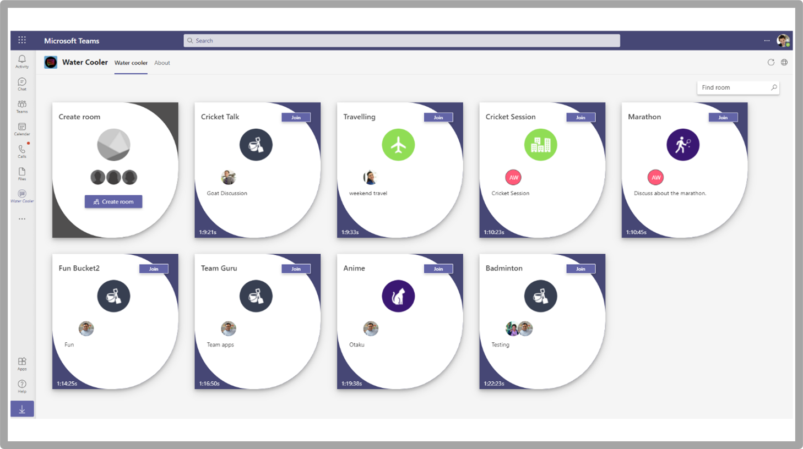
* __Join room__: Active conversations will show a Join button to allow visitors to immediately enter an ongoing conversation.
  
* __Room creation__: Easily create rooms by specifying the room name, short description, up to 5 colleagues as an initial group and selecting from the provided set of room images. Room creation will create a Teams call/chat for all attendees to interact.
  
* __Find room__: Use the find room feature to search keyword which will match the topic or short descriptions of ongoing conversations.

  
* __Attendee invitation__: Just as with any Teams call, additional users can be invited after room creation.
  
* __App badge__: Like other Teams apps, the Water Cooler icon on the left menu will show a badge with the number of active conversations visible from Teams while using any app.

  

## Architecture
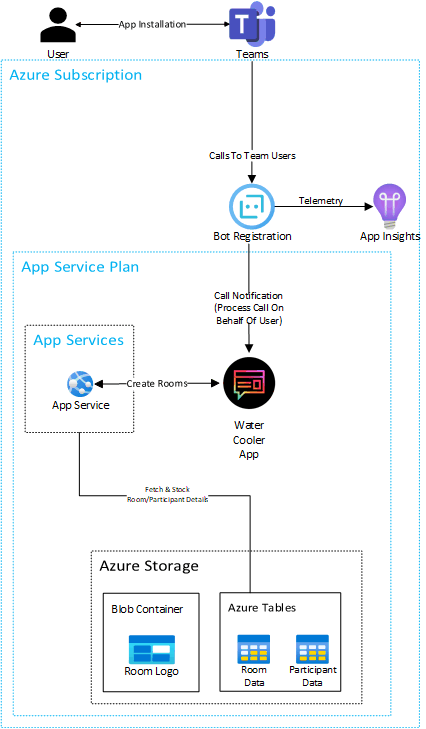

The __Water Cooler__ app has the following main components:
* __App Service (API)__: The API app service will provide the API endpoints to get the Rooms Data, its participants, and to Add a New Room. 
* __App Service (UI)__: The UI app service will display the Rooms and the participants in the room. 
* __Azure Storage__: Azure Storage tables will store the Room Data and the participants information in the tables.
* __Microsoft Graph API__: The app leverages Microsoft graph APIs to [List Participants](https://docs.microsoft.com/en-us/graph/api/call-list-participants?view=graph-rest-1.0&tabs=http), [Get User Profile.](https://docs.microsoft.com/en-us/graph/api/profile-get?view=graph-rest-beta&tabs=http)

## App Service
The app service implements two main concepts, Endpoints for displaying the calls and a scheduler job for updating the participant info.

#### API Endpoint
The end point will return all the active rooms by checking the azure storage tables. The azure storage tables will provide all active rooms. By utilizing the graph API, we will get the active participants in the call and return it data back to the UI. All these methods will be implemented using parallel async calls.

#### Scheduler
The scheduler will run for specified time and update database with the following things. It will loop through all the active calls and get the desired information from graph and based on the database records it will update or insert the records. E.g.: Currently there are 4 active users in the room. When the scheduler runs for the first time it will insert all 4 records. In next scheduler event we have a new participant in the call it will check for the change and as the new user is there it will insert the data. If any other user dropped off it will update the meeting end time for the user.

#### UI
The UI will fetch all the rooms and participants from the above-mentioned API and display the tiles information. The tile will have the Room name, description, participants list and a button to join the call. If the user is part of the call the join button will be displayed. Apart from that the first will be fixed and it will have the create new room button. "Click on the button to" open the dialog box with Room Name, Description and Participants list. After saving the Room a new call will be initiated. Bot will join the call and it will call other users who are invited initially. The UI application will continuously the poll the API to get the latest rooms information.

## Microsoft Graph API
#### Delegated Permissions
App service requires the following Delegated Permission:

Delegated Permission | Use Case|
------------- | ------------- |
User.Read | In order to read the profile information of the logged in user.

#### Application Permissions
App service requires the following Application Permissions:

Application Permission | Use Case|
------------- | ------------- |
Calls.AccessMedia.All | In order to access media streams in a call as an app.
Calls.Initaite.All | Initiate 1 to 1 outgoing call from app.
Calls.InitiaateGroupCall.All | Initiate outgoing group calls from the app.
Calls.JoinGroupCall.All | Join group calls and meetings as an app.
OnlineMeetings.Read.All | Read online meeting details.
OnlineMeetings.ReadWrite.All | Read and create online meetings.
People.Read.All | Read all users relevant peoples list.
User.Read.All | Read all users profile.


## Deployment Guide

1. __Register Azure AD application__: Register an Azure AD application in your tenant's directory for Water Cooler app.
    1. Log in to the Azure Portal for your subscription, and go to the App registrations blade.
    2. Click __New registration__ to create an Azure AD application.
       1. __Name__: Name of your Teams App - if you are following the template for a default deployment, we 
          recommend "Water Cooler".
       2. __Supported account types__: Select "Accounts in any organizational directory" (refer to image 
          below).
       3. Leave the "Redirect URI" field blank for now.

          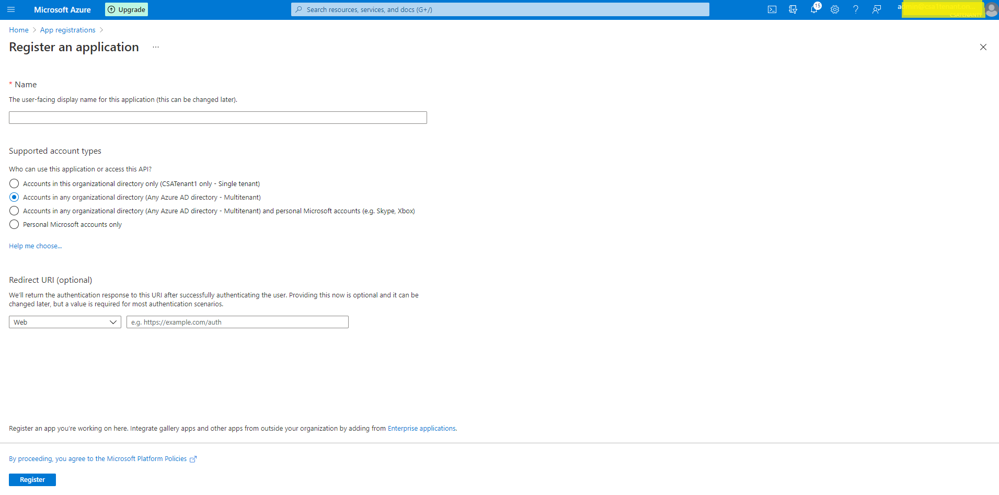
    3. Click __Register__ to complete the registration.
    4. When the app is registered, you'll be taken to the app's "Overview" page. Copy the __Application 
       (client) ID__; we will need it later. Verify that the "Supported account types" is set to __Multiple 
       organizations.__

       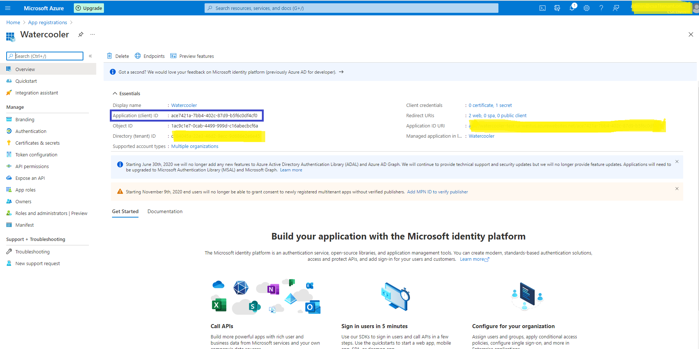
    5. On the side rail in the Manage section, navigate to the "Certificates & secrets" section. In the 
       Client secrets section, click on "+ New client secret". Add a description for the secret and choose 
       when the secret will expire. Click "Add".

       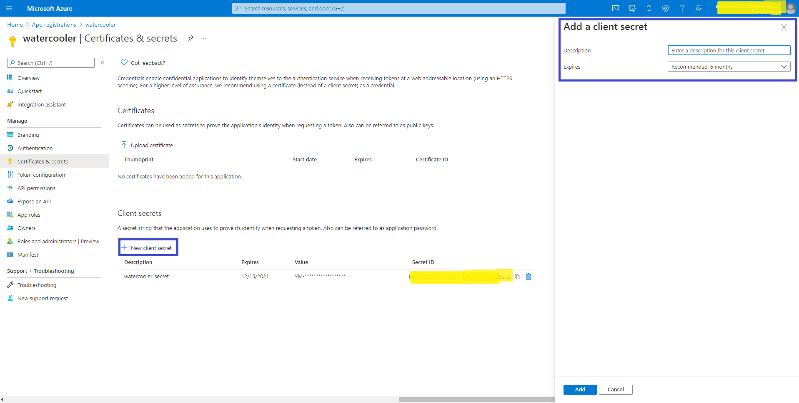
    6. Once the client secret is created, copy its __Value__; we will need it later. At this point you 
       should have the following 3 values. 
       1. Application (client) ID for the Water Cooler app.
       2. Client secret for the Water Cooler app.
       3. Directory (tenant) ID.

          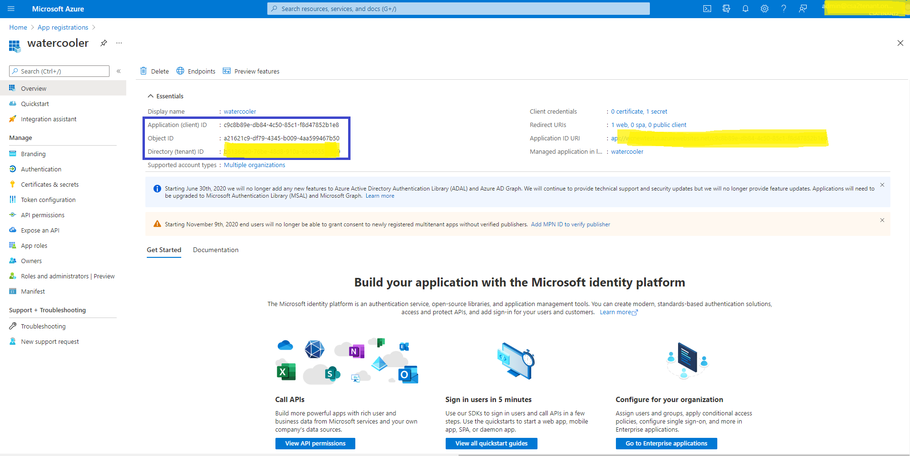

2. __Set-up Bot__
    1. Open bot channels registration.
    2. Fill appropriate details to create the bot.

       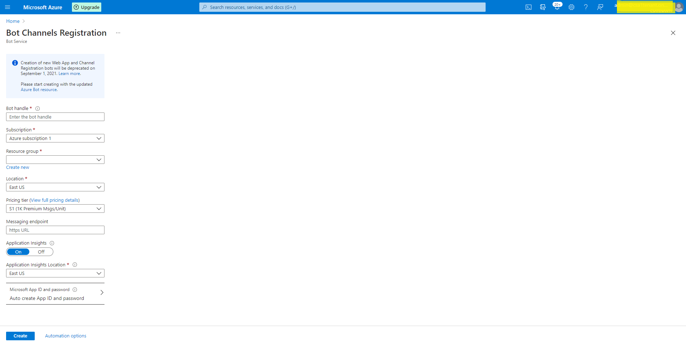
    3. Before you create, at the bottom of the page Click on 'Microsoft App ID and Password' (we don't want to use auto create). On the next screen, click 'Create New' and paste in the same Client ID and Secret you created in the step 1.

       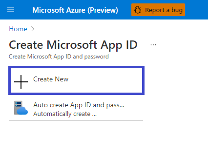
    4. Go to Channels from left tray.

       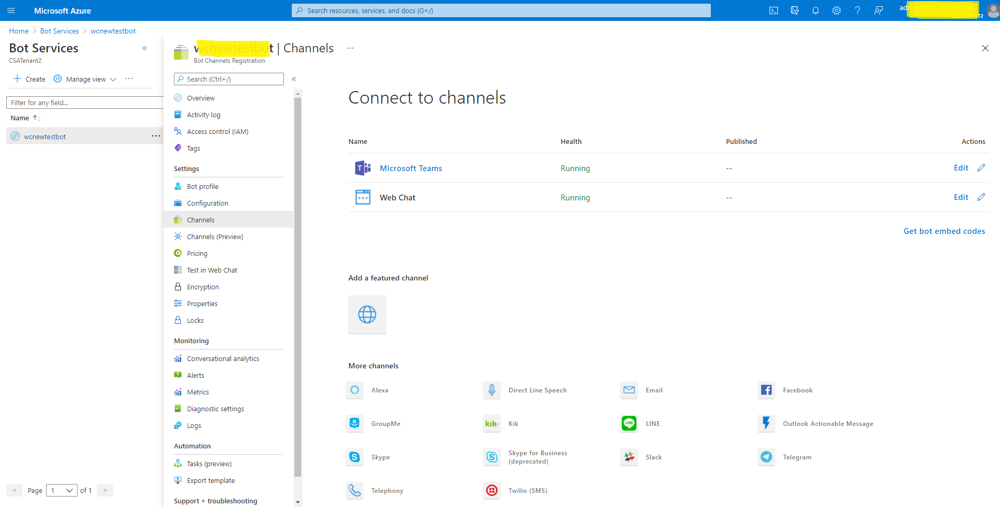
    5. Setup Microsoft Teams in channels

       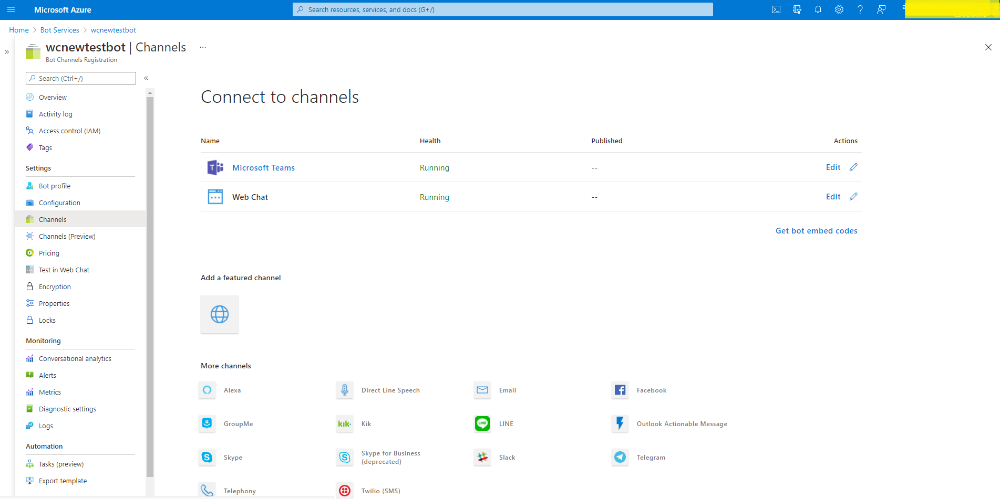

3. __Deploy your Azure subscription__
    1. Click on the __Deploy to Azure__ button below.

       [](https://portal.azure.com/#create/Microsoft.Template/uri/https%3A%2F%2Fraw.githubusercontent.com%2Fmicrosoft%2Fcsapps-msteams-watercooler%2Fmain%2FDeployment%2Fazuredeploy.json)
    2. When prompted, log in to your Azure subscription. 
    3. Azure will create a "Custom deployment" based on the Water Cooler ARM template and ask you to fill 
       in the template parameters.

       __Note__: Please ensure that you don't use underscore (_) or space in any of the field values 
       otherwise the deployment may fail.
    4. Select a subscription and a resource group.
       1. We recommend creating a new resource group.
       2. The resource group location MUST be in a datacenter that supports all the following:
          1. Storage Accounts
          2. Application Insights
          3. App Service
          4. Azure Bot Services
       For an up-to-date list of datacenters that support the above, click [here](https://azure.microsoft.com/en-us/global-infrastructure/services/?products=monitor,bot-services,storage,app-service)
    5. Enter a __Base Resource Name__, which the template uses to generate names for the other resources.
       1. The [Base Resource Name] must be available. For example, if you select contosoWaterCooler as the base name, the name contosoWaterCooler must be available (not taken); otherwise, the deployment will fail with a Conflict error. Base resource name should be lowercase. Base Resource name + storage account name must not exceed 24 characters.
       2. Remember the base resource name that you selected. We will need it later.
    6. Update the following fields in the template:
       1. __Client ID__: The application (client) ID of the Microsoft Teams Water Cooler bot app. (from Step 1)
       2. __Client Secret__: The client secret of the Microsoft Teams Water Cooler bot app. (from Step 1)
       3. __Tenant Id__: The tenant ID. (from Step 1). Basically, it will take it from the logged in tenant.
          You can also update manually.
       4. __Bot Id__: The Bot Id that you have created. If you create the clientId as Bot Id keep the BotId and 
          ClientId as same values
       5. __Bot Secret__: The created Bot Secret. If you create the ClientId as Bot Id then you can also keep 
          the client secret as Bot Secret.
       6. __Base Resource Name__: You need to think of a name here, keep it under 12 characters and all lower-case.
       7. __User Id__: This is the Azure AD GUID for the user account you want to run the application as. It just needs to be a regular AD account, no special licencing or permissions.
       8. __Storage Account Name__: you need to think of a short name here for the storage table, keep it under 12 characters and all lower-case.
       9. __Web API Url__: Think of a name for your backend app service (e.g. watercoolerwebapi) - write this down as you'll need it later.
       10. __Web UI Url__: Think of a name for your frontend app service (e.g. watercoolerwebui) - write this down as you'll need it later.
       11. __SKU__: The app service plan. Basically the values are F1 (Free), D1 (Shared), B1, B2, B3 
           (Basic), S1, S2, S3 (Standard plans), P1v2, P2v2, P3v2 (Premium V2 service plans), etc., You can 
           check all the plans and its costs [here](https://azure.microsoft.com/en-us/pricing/details/app-service/windows/). e.g. S1.

       __Note__: Make sure that the values are copied as-is, with no extra spaces. The template checks that GUIDs are exactly 36 
       characters.

       __Note__: If your Azure subscription is in a different tenant than the tenant where you want to install the Teams App, please 
       update the Tenant Id field with the tenant where you want to install the Teams App.
    7. If you wish to change the app name, description, and icon from the defaults, modify the corresponding template parameters.
    8. Agree to the Azure terms and conditions by clicking on the check box "I agree to the terms and conditions stated above" located at 
       the bottom of the page.
    9. Click on "Agree & Create" to validate the template. It will validate the template and will provide create button if everything is 
       good. Click on Create to start the deployment.
    10. Wait for the deployment to finish. You can check the progress of the deployment from the "Notifications" pane of the Azure Portal. It may take __up to an hour__ for the deployment to finish.
    11. Get the URL value from the Web API App Service that is provisioned. Copy that value to clipboard for use next (and later).
        1. Go to: Home -> Bot Services -> Your Bot -> Channels -> Microsoft Teams (edit) -> Calling tab -> Tick ‘Enable Calling’ -> create Webhook like example here: __https://yourwebapiurl.azurewebsites.net/callback/calling__
        2. Click Save

           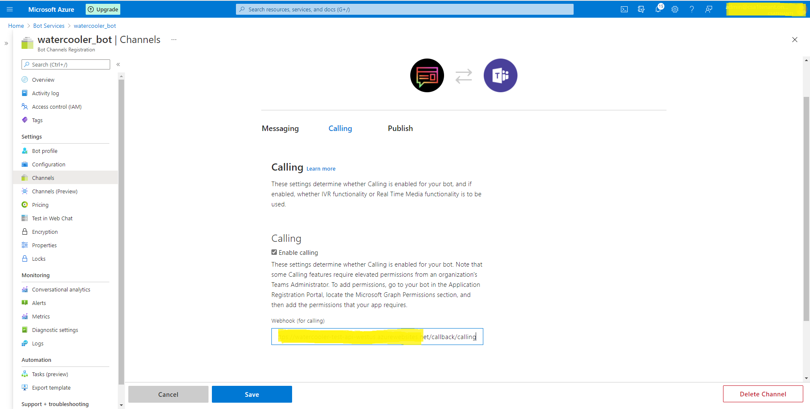

4. __Create UI App service for client App__
    1. Go to app services from homepage
    2. Click on create, the below interface will appear. Fill the appropriate details and create. Name = webui URL from 
       App Service (Step 3). E.g. watercoolerwebui (no https), Runtime stack = .Net 3.1

       
    3. After creating UI App service go to App service overview page.
    4. Copy UI App service URL and save to clipboard.
    5. Then edit the URL as shown below (you need to add ‘scm’ into the URL as shown. 
       e.g. https://%uiAppservicename%.scm.azurewebsites.net

    6. Open this URL in browser and go to Tools > ZIP push deploy

       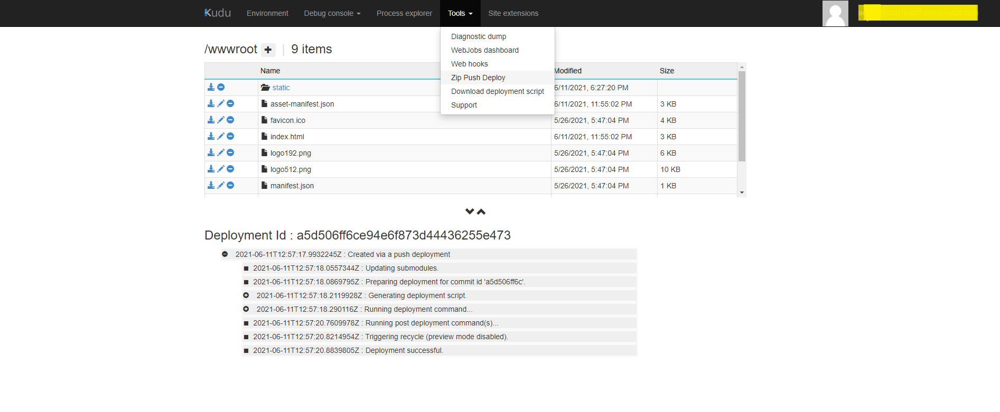
    7. Make sure you have cloned or Downloaded the repository. (You can do this from the Git repository and download the .Zip file).
    8. Extract the contents to your local machine.
    9. Open cmd, go to the waterCoolerClientApp directory.
    10. Open file explorer and open SRC/environment/development.ts file in any editor and replace the URL for the webapi URL (you should have this in your clipboard, if not go to Azure -> App Services -> Find your API service -> copy the URL).
    11. Save development.ts
    12. Now we're going to Build the UI app.
    13. Start by going back to the Command Prompt (CMD) window you opened earlier (you need to be int he waterCoolerClientApp director).
    14. Run the command as below (If this doesn’t work – you’ll need to install Node.JS).
        ```python
        npm install
    15. Write the command as below
        ```python
        npm run-script build
    16. Go to the ‘build’ folder and Zip the entire contents and upload in the window opened in step 5.
    17. Tip: You upload by dragging the .zip package onto the browser window:

        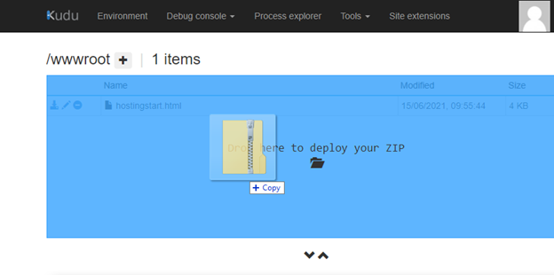
    18. You can check this has worked by going to: https://%webuiurl% and you should see the Loading screen (it will stay like this)

        

5. __Set-up Authentication__
   1. Go to App Registrations page [here](https://portal.azure.com/#blade/Microsoft_AAD_IAM/ActiveDirectoryMenuBlade/RegisteredApps) and open the Water Cooler app you created (in Step 1) from the application list.
   2. Under __Manage__, click on __Authentication__ to bring up authentication settings.
      1. Add a new entry to __Redirect URIs__:
         1. __Type__: Web
         2. __Redirect URI__: Enter  https://%clientAppServiceUrl%/auth-end for the URL e.g. https://yourappdomain.net/auth-end (client app service)
         3. You can find this URL by: Azure -> App Services -> your Web UI App Service -> copy URL
         4. This is NOT your webAPI url.
      2. Under __Implicit grant__, check __ID tokens__.
      3. Click __Configure__ to commit your changes.
   3. Back under __Manage__, click on __Expose an API__.
      1. Click on the __Set__ link next to __Application ID URI__, and change the value to api://%clientAppServiceURL%/clientId, this is the same URL you used in the previous step (but with api not https) see below: 
e.g. api://youappwebuiurl.azurewebsites.net/clientId.

      2. Click __Save__ to commit your changes.
      3. Click on __Add a scope__, under __Scopes defined by this API__. In the flyout that appears, enter the following values:
         1. __Scope name__:  access_as_user
         2. __Who can consent?__:  Admins and users
         3. __Admin and user consent display name__:  Access the API as the current logged-in user
         4. __Admin and user consent description__:  Access the API as the current logged-in user
      4. Click Add scope to commit your changes.
      5. Click __Add a client application__, under __Authorized client applications__. In the flyout that appears, enter the following values:
         1. __Client ID__: 5e3ce6c0-2b1f-4285-8d4b-75ee78787346 (<- Has to be this)
         2. __Authorized scopes__: Select the scope that ends with access_as_user. (There should only be 1 scope in this list.)
      6. Click __Add application__ to commit your changes.
      7. __Repeat the previous two steps__, but with client ID = 1fec8e78-bce4-4aaf-ab1b-5451cc387264. After this step you should have __two__ client applications (5e3ce6c0-2b1f-4285-8d4b-75ee78787346 and 1fec8e78-bce4-4aaf-ab1b-5451cc387264) listed under __Authorized client applications__.

6. __Add Permissions to your App__

   Continuing from the Azure AD app registration page where we ended Step 3.
   1. Select __API Permissions__ blade from the left-hand side.
   2. Click on __Add a permission__ button to add permission to your app.
   3. In Microsoft APIs under Select an API label, select the service and give the following permissions,
      1. Under Commonly used Microsoft APIs
      2. Select “Microsoft Graph”, then select Application permissions and check the following permissions,
         1. __Calls.AccessMedia.All__
         2. __Calls.Initiate.All__
         3. __Calls.InitiateGroupCall.All__
         4. __Calls.JoinGroupCall.All__
         5. __Calls.JoinGroupCallAsGuestAll__
         6. __OnlineMeetings.ReadWriteAll__
         7. __People.Read.All__
         8. __User.Read.All__
      3. then select __Delegated permissions__ and check the following permissions
         1. __Email__
         2. __Offline_access__
         3. __OnlineMeetings.ReadWrite__
         4. __Openid__
         5. __Profile__
         6. __User.Read__
      4. Click on __Add Permissions__ to commit your changes.

         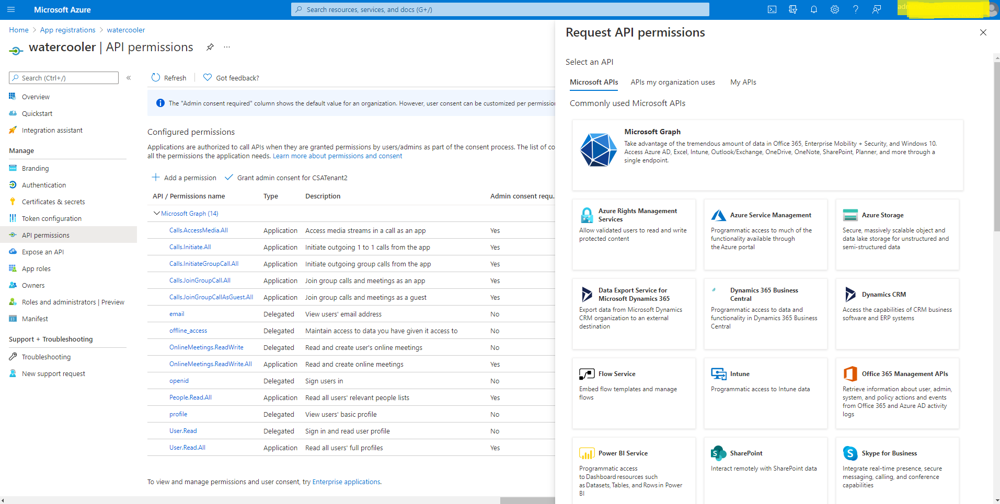
   4. You should have 14 Configured Permissions in total. If not, you’ve missed some!
   5. If you are logged in as the Global Administrator, click on the “Grant admin consent for %tenant-name%” button to grant admin consent, else inform your Admin to do the same through the portal.
Alternatively you may follow the steps below:
         1. Prepare link - https://login.microsoftonline.com/common/adminconsent?client_id=%appId%. Replace the %appId% with the Application (client) ID of Microsoft Teams Water Cooler bot app (from above).
         2. Global Administrator can grant consent using the link above.


7. __Give policy access to admin user__
   1. Open powershell as system administrator
   2. Write below commands to run and provide appropriate details
      1. Import-Module MicrosoftTeams
      2. $userCredential = Get-Credential
      3. Connect-MicrosoftTeams -Credential $userCredential
      4. New-CsApplicationAccessPolicy -Identity OnlineMeeting-WaterCooler -AppIds "%clientId%" -Description "Water cooler app - Online meeting policy for admin -Tenant"
      5. Grant-CsApplicationAccessPolicy -PolicyName OnlineMeeting-WaterCooler -Identity "%adminUserId%"

8. __Create the Teams app package__
   
   Create Teams app packages: To be installed to teams.
   1. Make sure you have cloned the app repository locally.
   2. Open the  Manifest\manifest.json file in a text editor.
   3. Change the placeholder fields in the manifest to values appropriate for your organization in developer property.
      1. MenifestVersion = 1.5
      2. Version = 1.0.0
      3. developer.name
      4. developer.websiteUrl
      5. developer.privacyUrl
      6. developer.termsOfUseUrl [Note: These 3 URLs should be different]
   4. Change the placeholder fields in the manifest to values appropriate to app name property
      1. short: “Water Cooler”,
      2. Full: “Water Cooler”
      3. Description.short = Must be less than 80 characters in length
   5. Change the placeholder fields in the manifest as an example below:
      1. "entityId": "waterCooler",
      2. "name": "Water Cooler",
      3. "contentUrl": https://yourwebui.azurewebsites.net/,
      4. "websiteUrl": "https://yourwebui.azurewebsites.net/",
   6. Change the <<clientId>> placeholder in the id setting of the webApplicationInfo section to be the %clientId% value. Change the <<appDomain>> placeholder in the resource setting of the webApplicationInfo section to be the %appDomain% value e.g. "api://appname.azurewebsites.net/clientId".
   7. Create a ZIP package with the  manifest.json, color.png, and outline.png. The two image files are the icons for your app in Teams.
      1. Name this package  manifest.zip, so you know that this is the app for the Water Cooler.
      2. Make sure that the 3 files are the top level of the ZIP package, with no nested folders.

         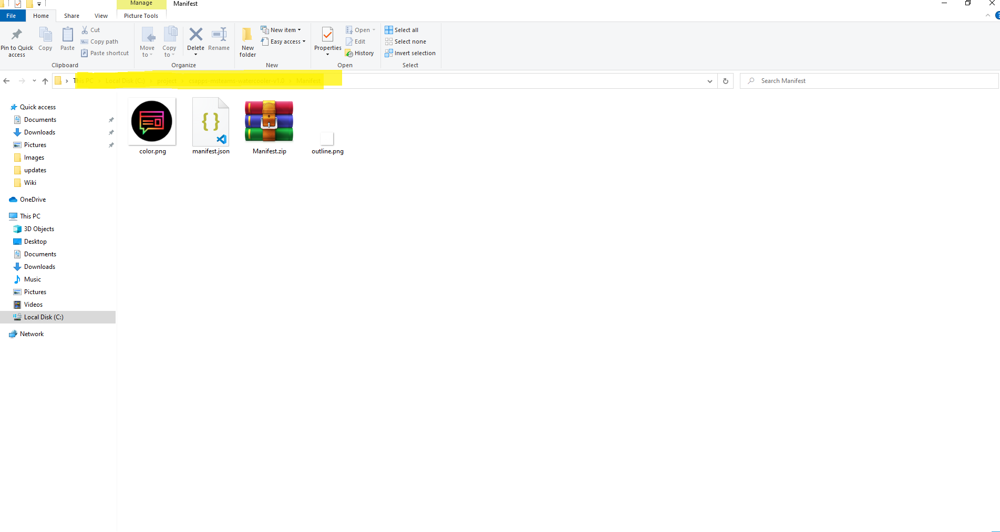

9. __Install app in Microsoft Teams__

   1. Install the Water Cooler app (the  manifest.zip package) with the tenant scope
   2. Install the app (the manifest.zip package) to the users and teams that will be the target audience.

10. __Upload room icons to blob storage__
    1. Open the created storage in the Resource group.
    2. Click on Storage explorer -> Blob containers.
    3. Click on upload and upload the icons for room as shown below.

       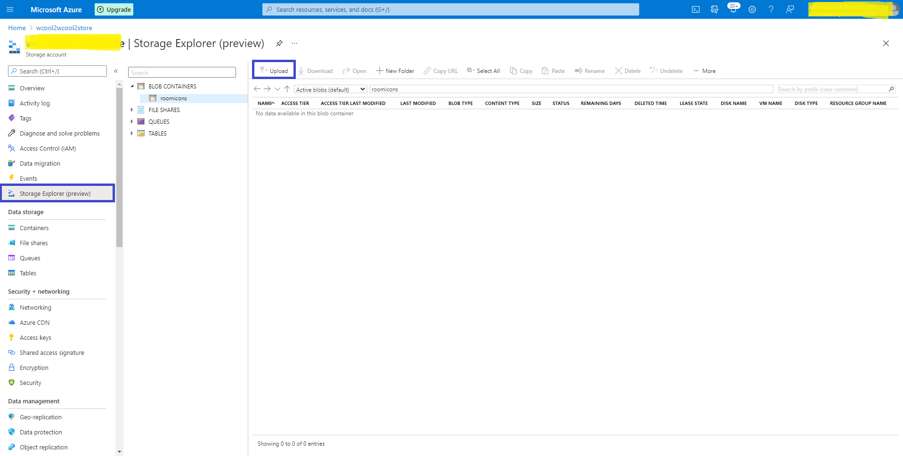
    
#### IMPORTANT
   Proactive app installation will work only if you upload the app to your tenant's app catalog. Install the app (the manifest.zip package) to the users and teams that will be the target audience.

## Feedback
Thoughts? Questions? Ideas? Share them with us on [Teams UserVoice](https://microsoftteams.uservoice.com/forums/555103-public)!

Please report bugs and other code issues here.


## Legal notice

This app template is provided under the [MIT License](https://github.com/microsoft/csapps-msteams-watercooler/blob/main/LICENSE) terms. In addition to these terms, by using this app template you agree to the following:

* You, not Microsoft, will license the use of your app to users or organization.
* This app template is not intended to substitute your own regulatory due diligence or make you or your app compliant with respect to any applicable regulations, including but not limited to privacy, healthcare, employment, or financial regulations.
* You are responsible for complying with all applicable privacy and security regulations including those related to use, collection, and handling of any personal data by your app. This includes complying with all internal privacy and security policies of your organization if your app is developed to be sideloaded internally within your organization. Where applicable, you may be responsible for data related incidents or data subject requests for data collected through your app.
* Any trademarks or registered trademarks of Microsoft in the United States and/or other countries and logos included in this repository are the property of Microsoft, and the license for this project does not grant you rights to use any Microsoft names, logos or trademarks outside of this repository. Microsoft’s general trademark guidelines can be found [here](https://www.microsoft.com/en-us/legal/intellectualproperty/trademarks/usage/general.aspx).
* If the app template enables access to any Microsoft Internet-based services (e.g., Office365), use of those services will be subject to the separately provided terms of use. In such cases, Microsoft may collect telemetry data related to app template usage and operation. Use and handling of telemetry data will be performed in accordance with such terms of use.
* Use of this template does not guarantee acceptance of your app to the Teams app store. To make this app available in the Teams app store, you will have to comply with the [submission and validation process](https://docs.microsoft.com/en-us/microsoftteams/platform/concepts/deploy-and-publish/appsource/publish), and all associated requirements such as including your own privacy statement and terms of use for your app.

## Contributing

This project welcomes contributions and suggestions. Most contributions require you to agree to a Contributor License Agreement (CLA) declaring that you have the right to, and actually do, grant us the rights to use your contribution. For details, visit [https://cla.microsoft.com](https://cla.microsoft.com/).

When you submit a pull request, a CLA-bot will automatically determine whether you need to provide a CLA and decorate the PR appropriately (e.g., label, comment). Simply follow the instructions provided by the bot. You will only need to do this once across all repos using our CLA.

This project has adopted the [Microsoft Open Source Code of Conduct](https://opensource.microsoft.com/codeofconduct/). For more information see the [Code of Conduct FAQ](https://opensource.microsoft.com/codeofconduct/faq/) or contact [opencode@microsoft.com](mailto:opencode@microsoft.com) with any additional questions or comments.